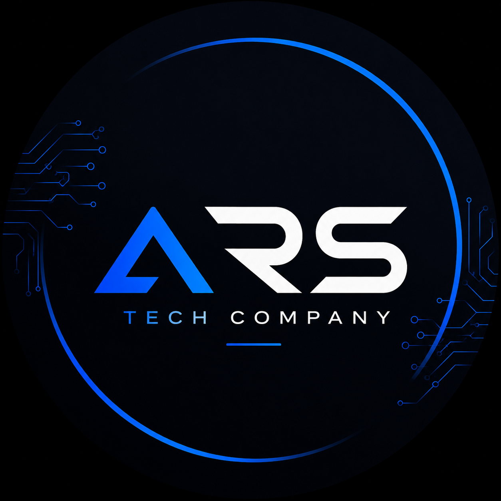

<a name="top"></a>

<div align="center">
  

  <h1>ARS TECH COMPANY — Site Institucional</h1>

  <p>Página de <em>under construction</em> com identidade visual da empresa</p>

  <p>
    <a href="https://arstechcompany.com.br">
      
    </a>
    
    
    
    
    
  </p>
</div>

---

## 📚 Sumário

- [Sobre o Projeto](#-sobre-o-projeto)
- [Pré-visualização](#-pré-visualização)
- [Stack Tecnológica](#️-stack-tecnológica)
- [Estrutura do Projeto](#-estrutura-do-projeto)
- [Paleta de Cores](#-paleta-de-cores)
- [Funcionalidades](#-funcionalidades)
- [Como Executar Localmente](#-como-executar-localmente)
- [Scripts Disponíveis](#-scripts-disponíveis)
- [Deploy](#-deploy)
- [Roadmap](#-roadmap)
- [Contribuindo](#-contribuindo)
- [Licença](#-licença)
- [Contato](#-contato)

---

## 📋 Sobre o Projeto

Site institucional da **ARS TECH COMPANY**, empresa brasileira de tecnologia especializada em:

- 💻 **Desenvolvimento de Software**
- ☁️ **Cloud Computing**
- ⚙️ **Automação e Tecnologia**
- 📣 **Marketing Digital**

O site está na fase de ***under construction***, exibindo uma landing page profissional com a identidade visual da empresa enquanto o site completo é desenvolvido.

> [!NOTE]
> A paleta de cores foi extraída programaticamente do arquivo `ars-tech-logo.png` usando Python/Pillow, garantindo que todo o design seja fiel à identidade visual da marca.

<a href="#top">↑ Voltar ao topo</a>

---

## 🖼️ Pré-visualização

> [!TIP]
> Para visualizar a página localmente, execute `npm run dev` e acesse [http://localhost:3000](http://localhost:3000).

A página exibe:
- Logo da empresa com animação de brilho pulsante
- Título e tagline institucional
- Grid com os 4 pilares de serviço da empresa
- Botão de contato por e-mail
- Fundo com gradiente navy extraído do logo

<a href="#top">↑ Voltar ao topo</a>

---

## 🛠️ Stack Tecnológica

| Tecnologia | Versão | Função |
|:---|:---:|:---|
| [Next.js](https://nextjs.org/) | `16.2.9` | Framework React com App Router e Turbopack |
| [React](https://react.dev/) | `19.2.4` | Biblioteca de UI |
| [TypeScript](https://www.typescriptlang.org/) | `5` | Tipagem estática |
| [Tailwind CSS](https://tailwindcss.com/) | `4` | Utilitários CSS (disponível no projeto) |
| [ESLint](https://eslint.org/) | `9` | Linting com regras Next.js + TypeScript |
| [PostCSS](https://postcss.org/) | — | Processamento CSS via `@tailwindcss/postcss` |

> [!IMPORTANT]
> O projeto usa **static export** (`output: "export"`), gerando arquivos HTML/CSS/JS estáticos sem necessidade de servidor Node.js em produção. Isso o torna compatível com GitHub Pages.

<a href="#top">↑ Voltar ao topo</a>

---

## 📁 Estrutura do Projeto

```text
arstechcompany-site/
├── app/
│   ├── globals.css            # Estilos globais com variáveis de cor do logo
│   ├── icon.png               # Favicon da empresa (logo 1254×1254 px)
│   ├── layout.tsx             # Layout raiz — metadata, fontes Geist, lang="pt-BR"
│   └── page.tsx               # Página principal (under construction)
├── public/
│   └── images/
│       └── ars-tech-logo.png  # Logo oficial da empresa (1254×1254 px)
├── CNAME                      # Domínio customizado para GitHub Pages
├── next.config.ts             # Config do Next.js (static export + images)
├── postcss.config.mjs         # PostCSS com plugin do Tailwind CSS 4
├── eslint.config.mjs          # ESLint flat config (next/core-web-vitals + ts)
├── tsconfig.json              # TypeScript — strict mode, path alias @/*
└── package.json               # Dependências e scripts npm
```

<a href="#top">↑ Voltar ao topo</a>

---

## 🎨 Paleta de Cores

As cores foram **extraídas programaticamente do logo** e definidas como variáveis CSS em `app/globals.css`:

<details>
<summary>Ver tabela completa da paleta</summary>

| Variável CSS | Hex | Prévia | Uso |
|:---|:---:|:---:|:---|
| `--bg-deep` | `#010a18` |  | Fundo profundo — início do gradiente |
| `--bg-navy` | `#05152d` |  | Fundo navy principal |
| `--bg-card` | `#041e42` |  | Fundo do container/card |
| `--accent` | `#0247b3` |  | Azul forte — hover e botões |
| `--accent-mid` | `#567eba` |  | Bordas e divisores |
| `--accent-light` | `#91b2e7` |  | Destaques e links |
| `--text-body` | `#c6d2e2` |  | Textos secundários |
| `--text-muted` | `#739bd9` |  | Textos suaves (tagline) |
| `--white` | `#ffffff` |  | Títulos principais |

</details>

<a href="#top">↑ Voltar ao topo</a>

---

## ✨ Funcionalidades

- [x] Logo com animação `pulse-glow` (brilho azul pulsante)
- [x] Título `ARS TECH COMPANY` com destaque em `--accent-light`
- [x] Grid de serviços 2×2 (desktop) / 1 coluna (mobile) com hover
- [x] Animações de entrada `fadeUp` escalonadas por elemento
- [x] Botão de contato com `mailto:` e efeito hover preenchido
- [x] Layout responsivo para mobile (breakpoint 540px)
- [x] Favicon personalizado com o logo (`app/icon.png`)
- [x] Título da aba: **ARS TECH COMPANY**
- [x] `lang="pt-BR"` e metadata institucional

<a href="#top">↑ Voltar ao topo</a>

---

## 🚀 Como Executar Localmente

### Pré-requisitos

- [Node.js](https://nodejs.org/) **≥ 18.x**
- **npm** (incluído com o Node.js)

### Instalação

```bash
# 1. Clone o repositório
git clone https://github.com/seu-usuario/arstechcompany-site.git
cd arstechcompany-site

# 2. Instale as dependências
npm install

# 3. Inicie o servidor de desenvolvimento
npm run dev
```

Acesse **[http://localhost:3000](http://localhost:3000)** no navegador.

> [!WARNING]
> Não use `npm run start` em desenvolvimento — esse comando serve o build de produção e requer `npm run build` antes.

<a href="#top">↑ Voltar ao topo</a>

---

## 📦 Scripts Disponíveis

| Comando | Descrição |
|:---|:---|
| `npm run dev` | Servidor de desenvolvimento com Turbopack e hot-reload |
| `npm run build` | Build de produção estático gerado na pasta `out/` |
| `npm run start` | Serve o build de produção localmente |
| `npm run lint` | Executa o ESLint em todo o projeto |

<a href="#top">↑ Voltar ao topo</a>

---

## 🌐 Deploy

O projeto é hospedado no **GitHub Pages** com domínio customizado via arquivo `CNAME`.

### Como fazer o deploy

```bash
# 1. Gera os arquivos estáticos na pasta out/
npm run build

# 2. Faça o push da branch main — o GitHub Pages publica automaticamente
git add .
git commit -m "chore: update build"
git push origin main
```

> [!NOTE]
> O arquivo `CNAME` contém `arstechcompany.com.br` e deve estar sempre na raiz do repositório para que o GitHub Pages mantenha o domínio customizado após cada deploy.

<details>
<summary>Detalhes das configurações de build</summary>

**`next.config.ts`**
```ts
output: "export"          // Exportação estática — sem servidor Node.js
images.unoptimized: true  // Obrigatório para next/image em static export
```

**`tsconfig.json`** (principais opções)
```json
"target": "ES2017",           // Compatibilidade ampla de browsers
"strict": true,               // Checagem rigorosa de tipos
"paths": { "@/*": ["./*"] }   // Alias de importação absoluta
```

</details>

<a href="#top">↑ Voltar ao topo</a>

---

## 🗺️ Roadmap

- [x] Página de *under construction* com identidade visual
- [x] Logo, favicon e paleta de cores da marca
- [x] Layout responsivo e animações CSS
- [x] E-mail de contato
- [ ] Desenvolver site institucional completo
- [ ] Página de portfólio de projetos
- [ ] Formulário de contato funcional
- [ ] Blog / artigos técnicos
- [ ] Versão em inglês (i18n)

<a href="#top">↑ Voltar ao topo</a>

---

## 🤝 Contribuindo

Este é um repositório privado da **ARS TECH COMPANY**. Contribuições internas são bem-vindas.

1. Crie uma branch a partir de `main`: `git checkout -b feat/nome-da-feature`
2. Faça as alterações e adicione commits descritivos seguindo o padrão [Conventional Commits](https://www.conventionalcommits.org/)
3. Abra um Pull Request descrevendo as mudanças

> [!CAUTION]
> Não faça commit de credenciais, tokens ou variáveis de ambiente sensíveis no repositório.

<a href="#top">↑ Voltar ao topo</a>

---

## 📄 Licença

Todos os direitos reservados © 2026 **ARS TECH COMPANY**.  
O código-fonte deste projeto é de propriedade exclusiva da empresa e não pode ser copiado, modificado ou distribuído sem autorização prévia.

<a href="#top">↑ Voltar ao topo</a>

---

## 📞 Contato

<div align="center">

**ARS TECH COMPANY**

✉️ [desenvolvimento@arstechcompany.com.br](mailto:desenvolvimento@arstechcompany.com.br)  
🌐 [arstechcompany.com.br](https://arstechcompany.com.br)

</div>

<a href="#top">↑ Voltar ao topo</a>

